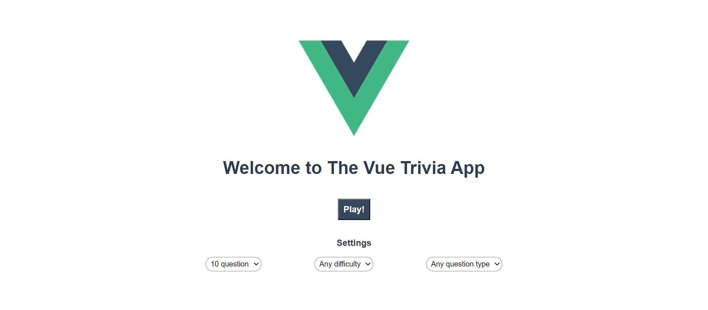
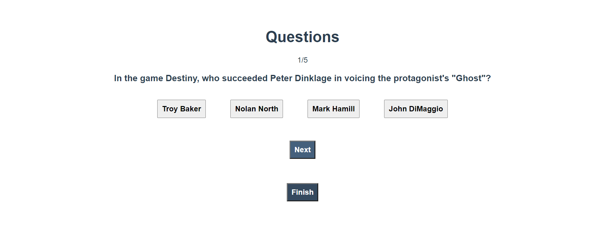
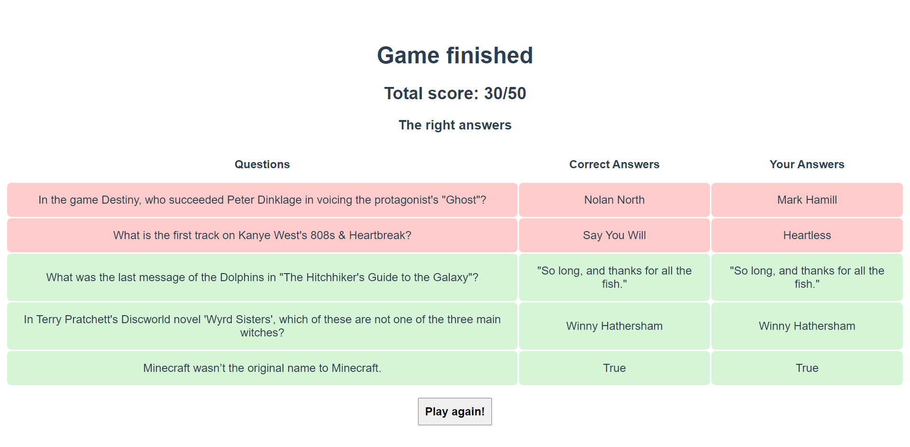

# Vue Trivia App
## Table of contents
  - [About](#about)
    - [Screen snippets](#screen-snippets)
      - [Home page](#home-page)
      - [Question page](#question-page)
      - [Result page](#result-page)
  - [Project setup](#project-setup)
    - [Compiles and hot-reloads for development](#compiles-and-hot-reloads-for-development)
    - [Compiles and minifies for production](#compiles-and-minifies-for-production)
    - [Lints and fixes files](#lints-and-fixes-files)
    - [Customize configuration](#customize-configuration)
- [Authors](#authors)

## About

Vue Trivia App is a simple game application built with Vue.js. It contains questions and answeres provided by 
[Trivia API](https://opentdb.com/api_config.php). The question types are multiple choice questions and true/false questions. 
When all questions have been aswered result page will be presented. It contains all the questions, correct answers, user's answers and total score. 

### Screen snippets
#### Home page


#### Question page


#### Result page


## Project setup
Clone the [VueTriviaApp repo](https://github.com/paularintaharri/VueTriviaApp), install Node.js and follow the steps:

```
npm install
```

### Compiles and hot-reloads for development
```
npm run serve
```

### Compiles and minifies for production
```
npm run build
```

### Lints and fixes files
```
npm run lint
```

### Customize configuration
See [Configuration Reference](https://cli.vuejs.org/config/).

## Authors
[Nicolas Valentine](https://github.com/veliValentine) and [Paula Rinta-Harri](https://github.com/paularintaharri)
